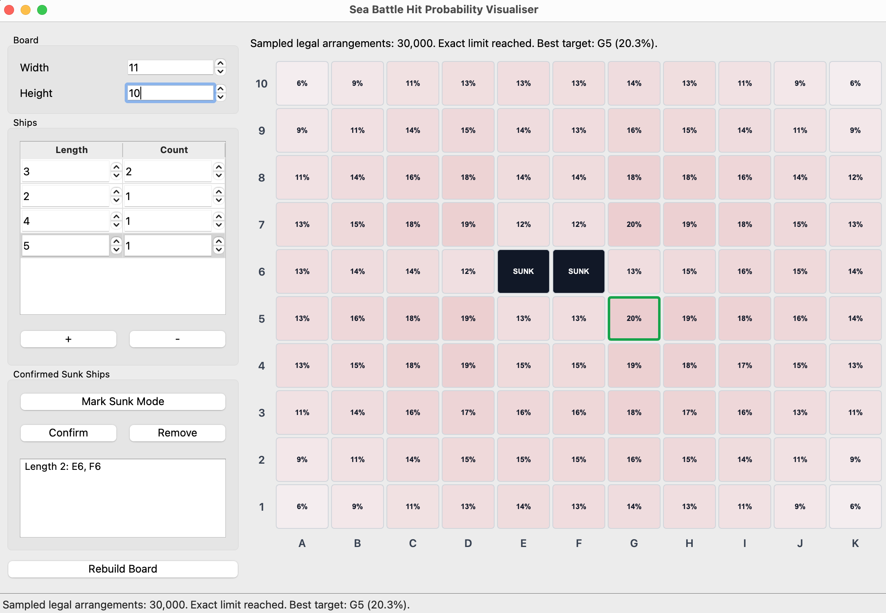

# Sea-Battle PvP Hit Probability Visualiser

## Introduction
This application can compute the probability of a hit in each Sea-Battle grid cell in real time, indicating the optimal position for a hit.

The GUI uses exact enumeration for small and medium positions. For large
positions, exact enumeration is capped at 1,000,000 legal arrangements and the
heat map falls back to 30,000 deterministic random legal samples. The status bar
will say when a result is sampled instead of exact.

Fleet arrangements are cached per board, ship configuration, and confirmed sunk
ship set. The first calculation after rebuilding the board can still take a
moment, but normal hit/miss clicks reuse the cache and only filter/count bitmasks.

Confirmed sunk ships are supported. Mark the known sunk cells as hits, enable
Mark Sunk Mode, select the hit cells that form the sunk ship, then press
Confirm. The app will fix those cells as one ship and remove that ship length
from the remaining fleet.

## Dependency
Python 3.12  
PySide6

## Setup
```bash
pip install -r requirements.txt
```

## Run
```bash
python main.py
```

## Screenshots


